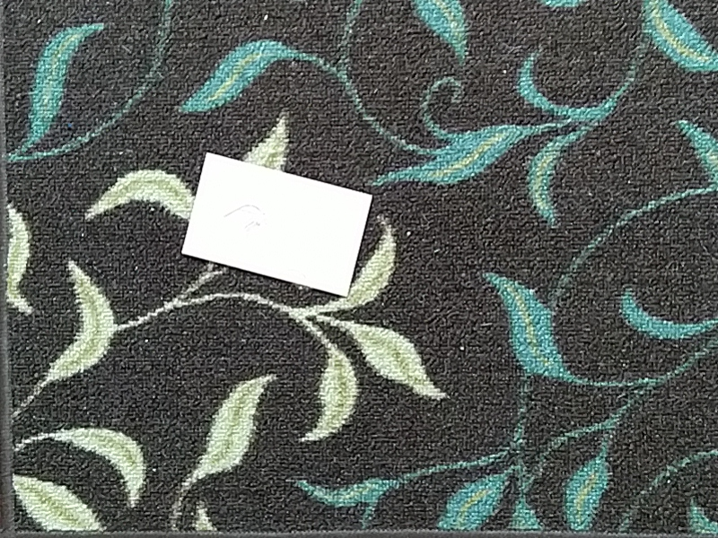
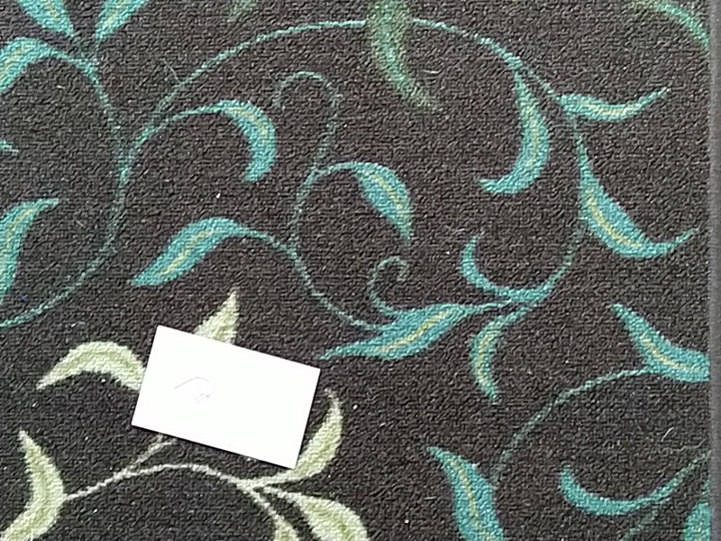
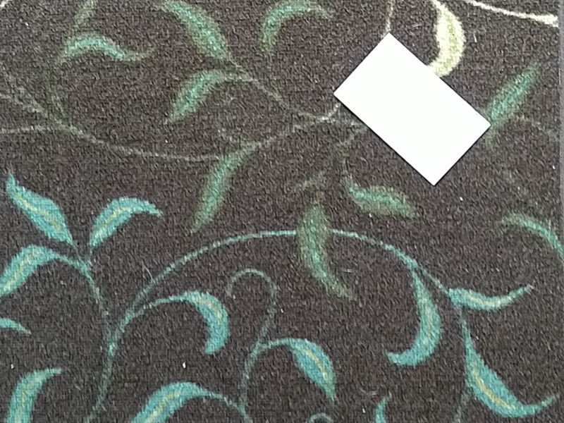
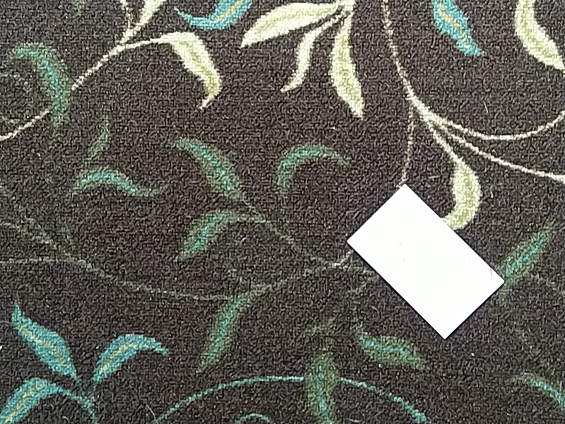
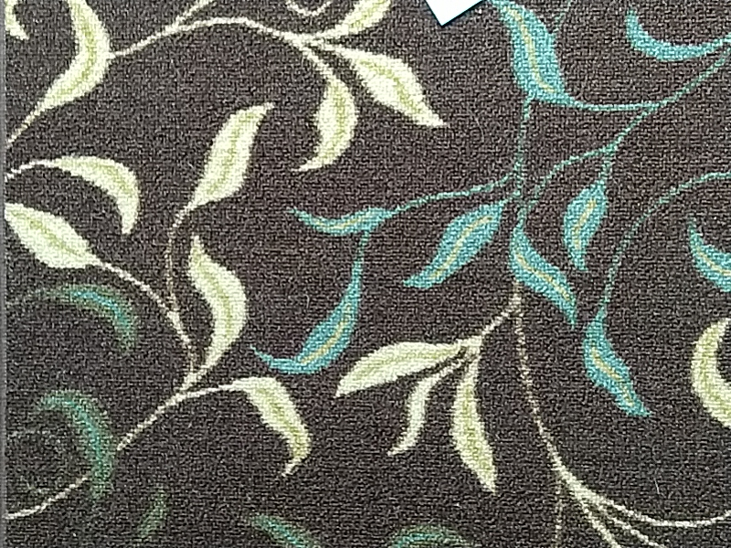
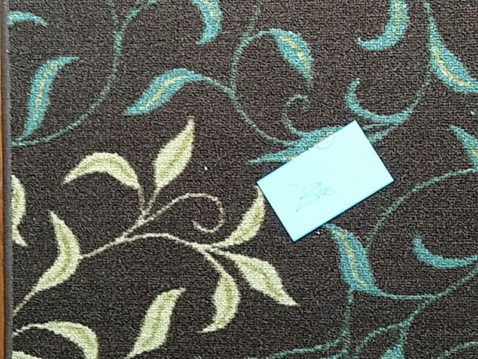
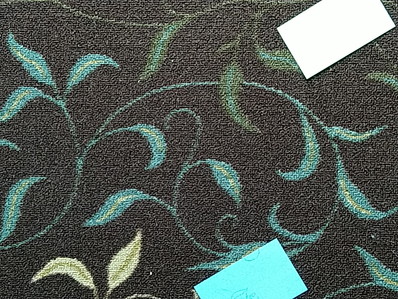
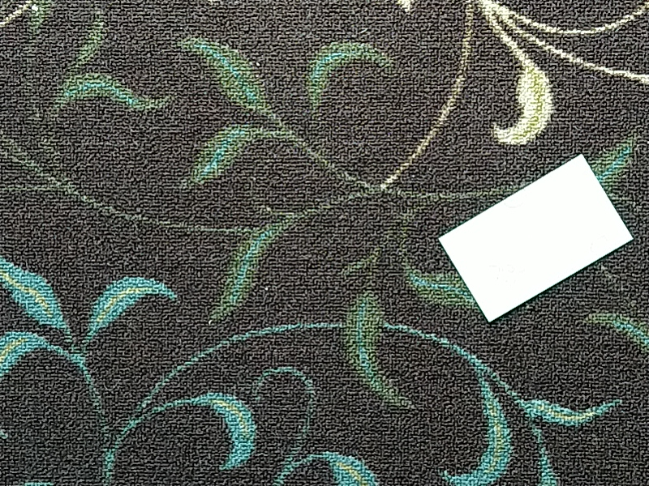
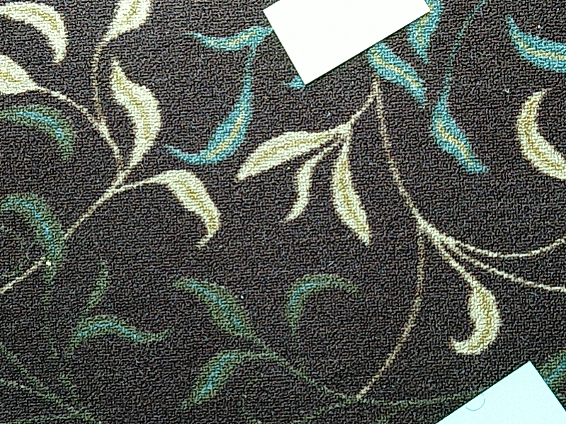
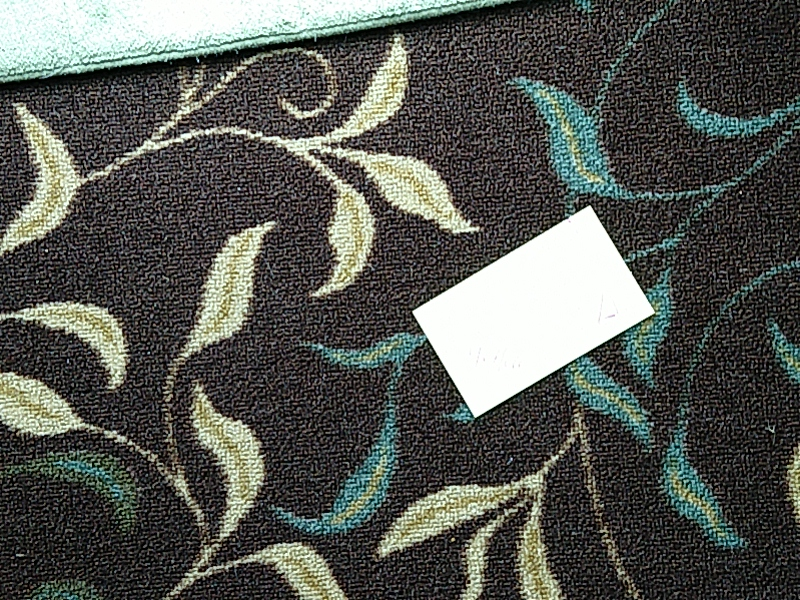

credit to https://www.pyimagesearch.com/2018/12/17/image-stitching-with-opencv-and-python, and lots of other people who've done all the real work preceeding this


### stitch the floor

*Note that the original video file isn't included in this repository.*

Take one minute chunk of video starting after 1:08
```bash
oName=day2a
ffmpeg -ss 00:01:08 -i ~/rov_videos_day2/2019-07-13_09.59.05.mkv -t 00:01:00 -vcodec copy videos/${oName}.mkv
```

Extract image every 0.5 seconds. crop 128 pixels from left and bottom (probably)
```bash
# frames per second... (images per second)
FPS=1
mkdir images/${oName}
ffmpeg -i videos/${oName}.mkv -qscale:v 2 -vf "crop=in_w-128:in_h-128:128:0,fps=${FPS}" images/${oName}/%05d.jpg
```

Move images into groups of no more than 10..
```bash
groups=$(( $(ls images/${oName} | wc -l) / 10))
for i in $(seq -w 0000 $groups)
do 
 mkdir images/${oName}_${i} 
 mv images/${oName}/${i}*.jpg images/${oName}_${i} 
done
```

Try to stitch each group
```bash
for i in $(seq -w 0000 $groups)
do 
 time python3 stitch.py --images images/${oName}_${i} --output stitched_output/${oName}_${i}.png
done
```

reset
```bash
rm -Rf images/${oName}* videos/${oName}*
```


#### random notes

- added -cthresh option to use a lower confidence level
    - after my initial image stitching test failed, setting confidence from 1.0 to 0.8 succeeded


this cropping results in a super narrow panorama..
```bash
python3 stitch.py --images images/rug   --output rug-cropped.png --crop 1
```
to be fair, the author said it was a hack! so we just don't use it..
```bash
python3 stitch.py --images images/rug  --output rug.png
```












    https://stackoverflow.com/questions/40088222/ffmpeg-convert-video-to-images/40090033


