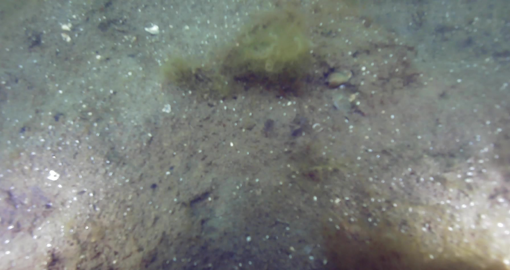
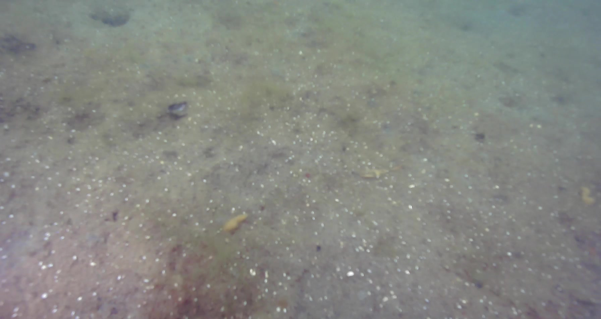
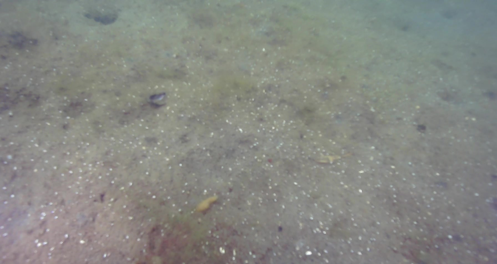
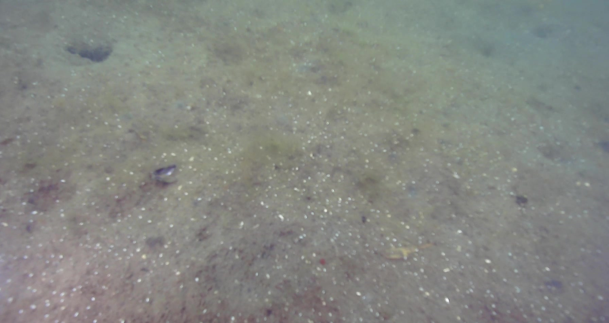
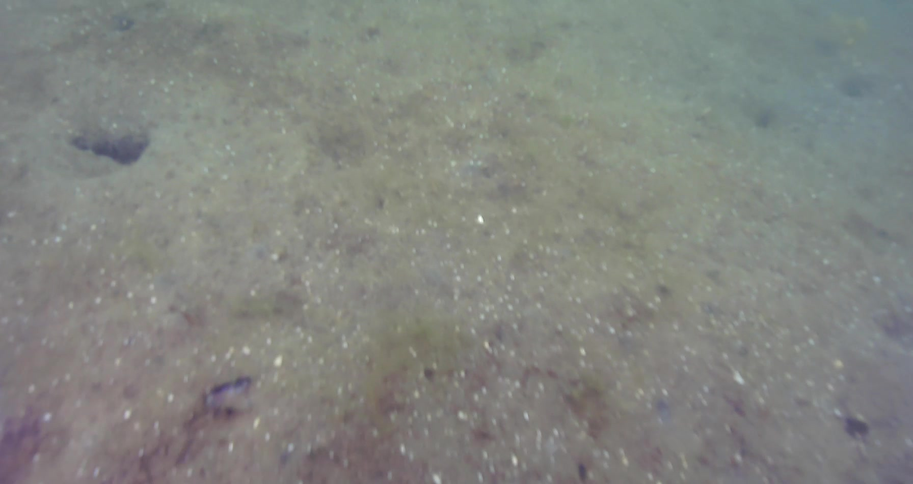
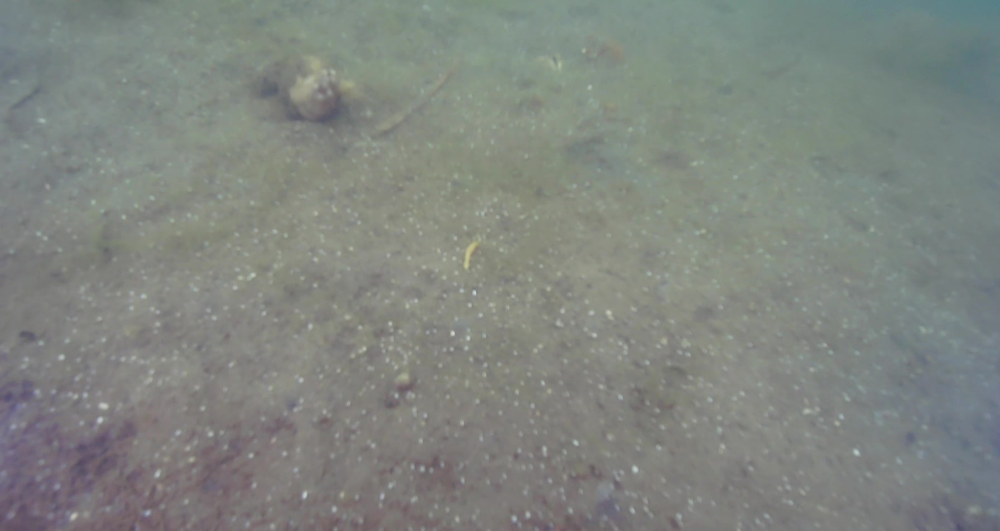
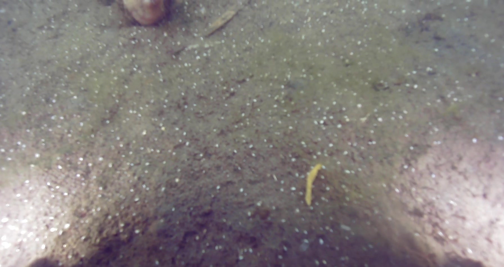
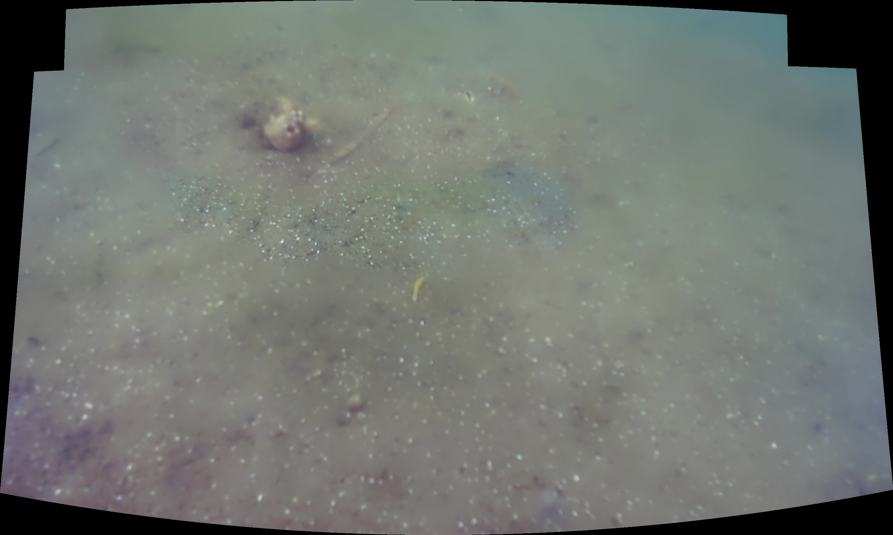

day2a_0000
```bash
[INFO] loading images...
[INFO] Using Confidence Threshold: 1.0
[INFO] stitching images...
```


day2a_0001
```bash
[INFO] loading images...
[INFO] Using Confidence Threshold: 1.0
[INFO] stitching images...
```


day2a_0002
```bash
[INFO] loading images...
[INFO] Using Confidence Threshold: 1.0
[INFO] stitching images...
```


day2a_0003
```bash
[INFO] loading images...
[INFO] Using Confidence Threshold: 1.0
[INFO] stitching images...
```





day2a_0004
```bash
[INFO] loading images...
[INFO] Using Confidence Threshold: 1.0
[INFO] stitching images...
```






day2a_0005
```bash
[INFO] loading images...
[INFO] Using Confidence Threshold: 1.0
[INFO] stitching images...
```












day2a_0006
```bash
[INFO] loading images...
[INFO] Using Confidence Threshold: 1.0
[INFO] stitching images...
[INFO] image stitching failed (1)
```


